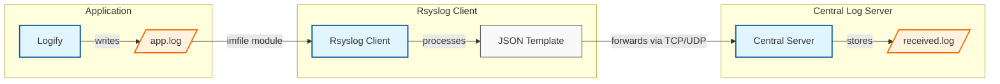

# Centralized Logging with rsyslog

A comprehensive guide to setting up a centralized logging system using Docker and rsyslog.

## Overview

This project implements a log processing stack using Docker with three main services:
- **Logify**: Generates log entries
- **Rsyslog Client**: Monitors and forwards logs from Logify
- **Central Log Server**: Receives and stores logs from the Rsyslog Client

## Prerequisites

- Docker and Docker Compose installed
- Basic understanding of Docker and Docker Compose

## Directory Structure

```
log-processing-stack/
├── docker-compose.yml
├── logs/                    # Shared log directory
├── logify/
│   ├── Dockerfile
│   └── (config files)
├── rsyslog/
│   ├── Dockerfile
│   ├── rsyslog.conf
│   └── rsyslog.d/
│       └── 51-rsyslog-logify.conf
└── central-log-server/
    └── 50-central-server.conf
```

## Configuration Files

### 1. docker-compose.yml

```yaml
version: '3.8'

services:
  rsyslog:
    build: ./rsyslog
    container_name: rsyslog-client
    volumes:
      - ./rsyslog/rsyslog.conf:/etc/rsyslog.conf
      - ./rsyslog/rsyslog.d/51-rsyslog-logify.conf:/etc/rsyslog.d/51-rsyslog-logify.conf
      - ./logs:/var/log/logify
    ports:
      - "514:514/udp"
      - "514:514/tcp"
    depends_on:
      - logify

  logify:
    build: ./logify
    container_name: logify
    volumes:
      - ./logs:/var/log/logify
    depends_on:
      - rsyslog

  logserver:
    image: ubuntu:22.04
    container_name: central-log-server
    volumes:
      - ./central-log-server/50-central-server.conf:/etc/rsyslog.d/50-central-server.conf
      - ./central-log-server:/var/log/central-logs
    ports:
      - "10514:514/tcp"
      - "10514:514/udp"
    command: >
      bash -c "
      groupadd -g 103 syslog &&
      useradd -r -u 101 -g syslog syslog &&
      chown -R syslog:syslog /var/log/central-logs &&
      apt-get update &&
      apt-get install -y rsyslog &&
      rsyslogd -n"
```

### 2. rsyslog/rsyslog.d/51-rsyslog-logify.conf

```
module(load="imfile")

input(type="imfile"
    File="/var/log/logify/app.log"
    Tag="FileLogs"
    Facility="local0")

template(name="json-template" type="list" option.jsonf="on") {
    property(outname="@timestamp" name="timereported" dateFormat="rfc3339" format="jsonf")
    property(outname="host" name="hostname" format="jsonf")
    property(outname="severity" name="syslogseverity" format="jsonf" datatype="number")
    property(outname="facility" name="syslogfacility" format="jsonf" datatype="number")
    property(outname="message" name="msg" format="jsonf")
}

if $syslogtag == 'FileLogs' then {
    action(type="omfwd"
        target="central-log-server"
        port="514"
        protocol="tcp"
        template="json-template")
}
```

### 3. central-log-server/50-central-server.conf

```
module(load="imtcp")
input(type="imtcp" port="514")

module(load="imudp")
input(type="imudp" port="514")

*.* /var/log/central-logs/received.log
```

## Setup and Usage

1. **Build and Start Containers**
   ```bash
   docker compose up --build -d
   ```

2. **Verify Configuration**
   
   Check Logify container:
   ```bash
   docker exec -it logify ls -la /var/log/logify/
   ```

   Check Central Log Server:
   ```bash
   docker exec -it central-log-server tail -f /var/log/central-logs/received.log
   ```

3. **Test Logging**
   
   Add a test log entry:
   ```bash
   docker exec -it logify bash -c 'echo "{\"status\":200, \"msg\":\"Manual log entry test\"}" >> /var/log/logify/app.log'
   ```

   Verify reception:
   ```bash
   docker exec -it central-log-server tail -f /var/log/central-logs/received.log
   ```

## Log Format Example

```json
{
    "@timestamp": "2024-08-11T23:22:22.054939+03:00",
    "host": "MariaP14s",
    "severity": 5,
    "facility": 16,
    "message": "{\"status\": 200, \"ip\": \"REDACTED_IP\", \"level\": 30, \"msg\": \"Task completed successfully\", \"pid\": 24378, \"ssn\": \"REDACTED_SSN\", \"time\": 1723407742}"
}
```

## Troubleshooting

- **Permission Errors**: Check volume permissions in docker-compose.yml
- **File Not Found**: Verify volume mapping paths
- **Syntax Errors**: Check rsyslog configuration with `rsyslogd -f /etc/rsyslog.d/51-rsyslog-logify.conf -N1`
- **Line Ending Issues**: Fix with `tr -d '\r' < /usr/local/bin/logify.sh > /usr/local/bin/logify_fixed.sh`

## Advanced Features

### Log Transformation
Rsyslog can transform logs before forwarding using templates and external processing scripts. See the example Python redaction script in the documentation for handling sensitive data like IP addresses and SSNs.

## How It Works



Rsyslog uses modules for:
- Input (imfile, imjournal)
- Modification (mmjsonparse, mmfields)
- Output (omfile, omelasticsearch)

Default configuration routes system logs to /var/log, with custom rules definable in /etc/rsyslog.d/.
